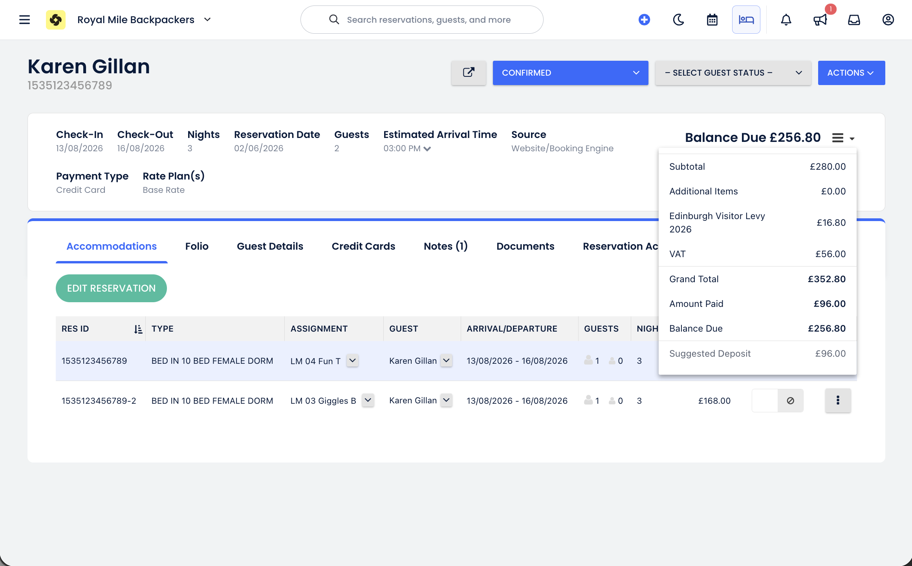
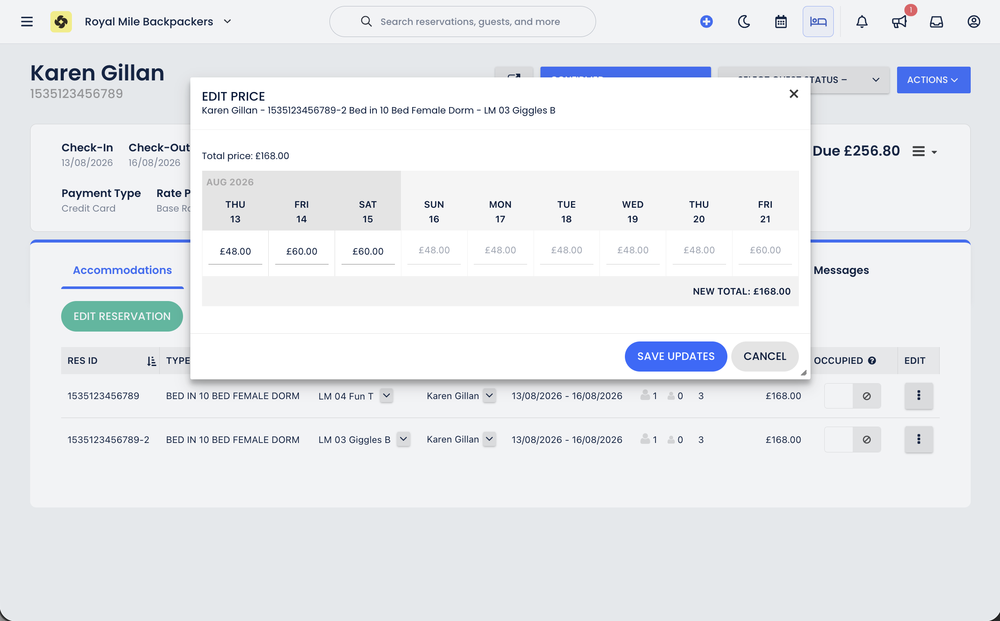
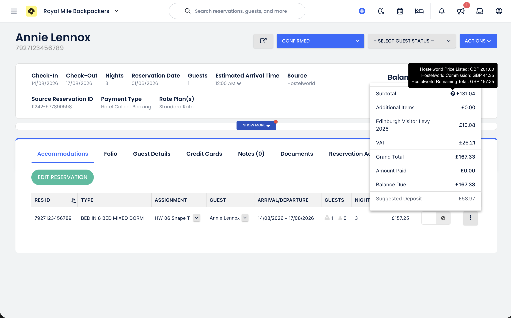
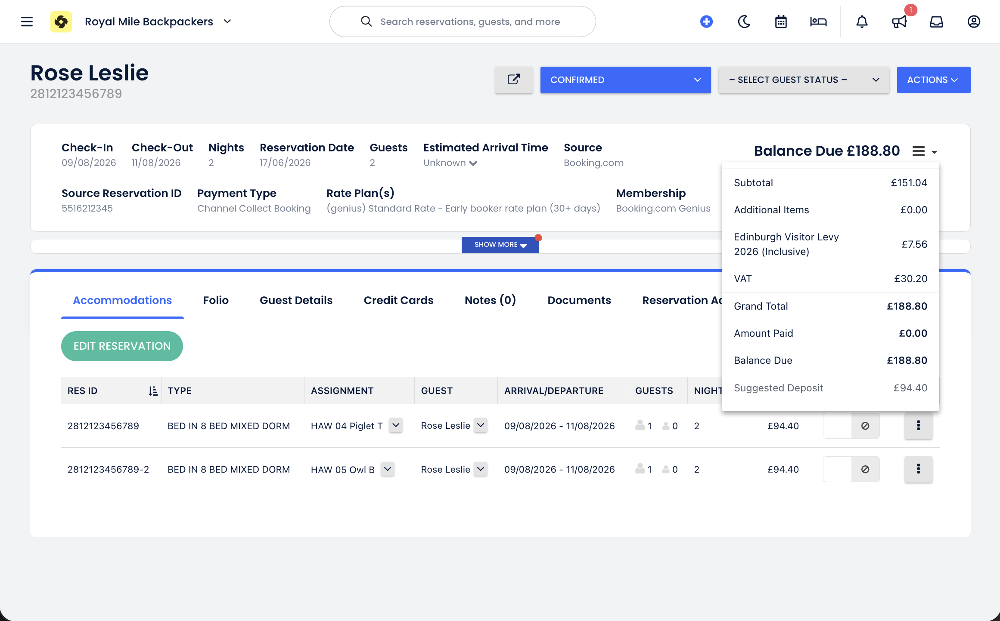
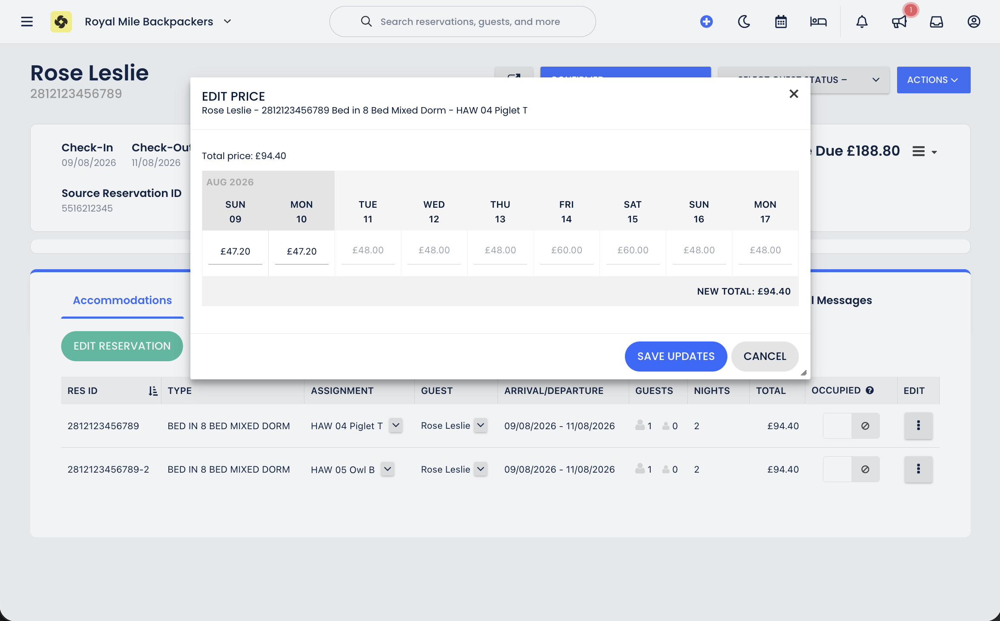

# Edinburgh Visitor Levy (EVL) — Cloudbeds by booking source

How the Edinburgh Visitor Levy appears on Cloudbeds folios for different booking channels and how the amounts are calculated.

---

## Overview

Edinburgh’s visitor levy is **5% of pre-VAT accommodation**, capped at the **first five consecutive eligible nights** of a stay. Cloudbeds applies EVL differently depending on whether the tax is configured as **exclusive** (added on top of the rate) or **inclusive** (carved out of a fixed OTA total).

This project uses two Cloudbeds taxes per property:

| Label                                                        | Type | Typical sources |
|--------------------------------------------------------------|---|---|
| Edinburgh Visitor Levy 2026                                  | **Exclusive** (5%) | Direct, walk-in, Hostelworld |
| Edinburgh Visitor Levy 2026 (Inclusive) | **Inclusive** (6% of net) | Booking.com, Agoda, Agoda / Priceline |

The inclusive tax is set at **6%** rather than 5% so that VAT on the levy is included in the EVL line, consistent with how the exclusive tax works on direct and Hostelworld bookings. Council remittance from either line is obtained by dividing the folio EVL total by **1.2**.

An automated adjustment job compares the folio EVL to the expected amount and posts corrections where needed (see [Automation](#automation)).

### Why exclusive for some channels and inclusive for others?

This is a **Cloudbeds folio constraint**, not a council or remittance rule. Edinburgh liability and quarterly reporting via [visitorlevy.scot](https://visitorlevy.scot/visitorlevy/) sit with the property regardless of channel.

| Model | When it fits | Guest total |
|---|---|---|
| **Exclusive** (direct, walk-in, Hostelworld) | You control pricing; levy is added on top of accommodation | Base + EVL |
| **Inclusive** (Booking.com, Agoda, Priceline) | OTA sends a **fixed total** into Cloudbeds | Fixed — EVL is carved out, not added on top |

Using the **exclusive** tax on an OTA booking would increase the folio above the channel quote (especially on prepaid / channel-collect stays). Inclusive tax splits the fixed OTA gross into net accommodation, EVL, and room VAT without changing what the guest pays.

You could simplify config by baking levy into OTA rates and showing no separate EVL line, but that hides folio visibility and makes council remittance (EVL folio total ÷ 1.2) harder. The two-tax setup keeps OTA totals aligned **and** a clear EVL line for reporting.

---

## Direct bookings





The exclusive **Edinburgh Visitor Levy 2026** tax applies **5% to the final accommodation total the guest pays** (VAT-inclusive room revenue).

**Example:** 3 nights for 2 people at £168 per person-night

| Line | Amount |
|---|---:|
| Room revenue (pre-VAT) | £280.00 |
| VAT (20% of £280) | £56.00 |
| Accommodation subtotal | **£336.00** |
| EVL (5% of £336) | **£16.80** |
| **Grand total** | **£352.80** |

The £16.80 EVL line **includes VAT on the levy**. To split it:

```
Council remittance  = £16.80 ÷ 1.2 = £14.00
VAT on levy         = £14.00 × 20% = £2.80  (remit to HMRC)
```

Applying 5% to the post-VAT total produces the same result as applying 5% to the pre-VAT room rate and then adding 20% VAT on the levy.

> **Note:** On direct bookings, the **Edinburgh Visitor Levy 2026** line item includes VAT. It is **not** split into the separate VAT line on the folio.

---

## Hostelworld bookings



Hostelworld bookings use the same exclusive tax as direct bookings: **5% of the final price the guest pays**.

The guest-facing total is shown when clicking the **(?)** icon next to the subtotal. Cloudbeds room rates for Hostelworld are stored **after deducting the Hostelworld commission**, so the levy Cloudbeds auto-calculates is **too low** — it misses the portion of the levy that applies to the commission.

**Example:**

| Item | Amount |
|---|---:|
| Guest pays (listed price) | £201.60 |
| Hostelworld commission | £44.35 |
| Commission as % of listed price | £44.35 ÷ £201.60 ≈ 22% |
| Cloudbeds auto-calculated EVL (on net rates) | Too low |
| **Correct EVL** | 5% × £201.60 = **£10.08** |

#ronbot automatically posts a folio adjustment to correct the levy on Hostelworld bookings at the time of booking.

---

## Booking.com (BDC) bookings





Booking.com uses the **inclusive** tax. The OTA total is fixed and must not change. Cloudbeds calculates inclusive taxes from **rates per person per night**, rounded to two decimal places.

**Example:** £188.80 total, 2 guests, 2 nights — £47.20 per person per night

### How Cloudbeds calculates at 5% inclusive

```
Room rate ex-VAT, ex-EVL  = £47.20 ÷ 1.25 = £37.76
EVL per person per night  = £37.76 × 5%   = £1.89
EVL for 2 nights × 2 guests = £1.89 × 4  = £7.56
```

This approach does **not** include VAT on the EVL itself — a limitation of how Cloudbeds handles inclusive taxes (“tax on the tax” is ignored).

### Statutory breakdown (total unchanged)

To split the fixed guest total without altering the amount charged:

```
Net accommodation (ex-VAT, ex-EVL)  = £188.80 ÷ 1.26 = £149.84
Council EVL                           = £149.84 × 5%    = £7.49
VAT on room + levy                    = (£149.84 + £7.49) × 20% = £31.47
Total                                 = £149.84 + £7.49 + £31.47 = £188.80
```

Cloudbeds’ 5% inclusive calculation (£7.56) is slightly higher than the statutory council amount (£7.49).

### Configuration choice: 5% vs 6% inclusive

Two approaches were considered:

| Option | Approach | Trade-off |
|---|---|---|
| **A** | Keep 5% inclusive | EVL folio totals are slightly off (£7.56 vs £7.49). Remittance can be corrected with a × 1.25/1.26 adjustment. |
| **B** | Use **6% inclusive** | EVL line includes VAT on the levy (like direct/HWL). Council remittance = EVL folio total ÷ 1.2. Consistent across all sources; inclusive rate (6%) differs from exclusive rate (5%). |

**Option B is recommended.** The inclusive tax is configured at **6% of net** so the EVL line matches the direct-booking pattern (levy + VAT-on-levy baked in). Divide the folio EVL total by 1.2 for council remittance.

With 6% inclusive, the same £188.80 booking yields an EVL line of **£9.00** and council remittance of **£7.50** (vs statutory £7.49 — within rounding).

### Booking.com partner guidance

[Booking.com’s Edinburgh Visitor Levy page](https://partner.booking.com/en-gb/help/commission-invoices-tax/local-taxes/edinburgh-visitor-levy) (updated ~2026) states that:

- From **1 October 2025**, Booking.com **attributes 5%** of the nightly accommodation rate to the levy for stays from **24 July 2026**.
- The price shown on Booking.com and charged to the guest **should include** the levy (hotel collect or channel collect).
- Booking.com **cannot cap at five consecutive nights**; it attributes 5% for the whole stay. Refund any excess to the guest at departure if applicable.

---

## Agoda / Priceline bookings

Agoda / Priceline use the same **inclusive** tax and calculation as Booking.com. The OTA total is fixed in Cloudbeds and EVL is carved out of the rate — for both **hotel collect** and **channel collect** source variants (`Agoda (…)`, `Agoda / Priceline (…)`).

---

## Automation

For all booking sources above, the processor:

1. **Corrects Hostelworld levies** when Cloudbeds under-calculates due to commission (see [Hostelworld bookings](#hostelworld-bookings)).
2. **Reduces EVL** when a stay exceeds **five eligible nights** (Cloudbeds does not reliably enforce the night cap).
3. **Logs Booking.com and Agoda / Priceline discrepancies** without writing folio changes, because the channel total is fixed and coordinated EVL/VAT/room-rate adjustments would be required.
4. On **OTA stays over five nights**, may log that Cloudbeds / the channel over-attributed levy — manual guest refund may still be needed (Booking.com documents this; Agoda has no equivalent EVL-specific guidance).

Adjustment notes on the folio are suffixed with `-RONBOT` for traceability.

---

## Quick reference

| Source | Cloudbeds tax | Levy base | EVL line includes VAT? | Council remittance |
|---|---|---|---|---|
| Direct / walk-in | Exclusive 5% | Guest accommodation total (incl. room VAT) | Yes | EVL ÷ 1.2 |
| Hostelworld | Exclusive 5% | Listed guest price (incl. commission) | Yes | EVL ÷ 1.2 |
| Booking.com | Inclusive 6% of net | Per-person nightly rate (fixed OTA total) | Yes | EVL ÷ 1.2 |
| Agoda / Priceline | Inclusive 6% of net | Per-person nightly rate (fixed OTA total) | Yes | EVL ÷ 1.2 |

Numeric Cloudbeds tax IDs vary by property; labels above are the usual English names.

### External references

| Source | EVL guidance |
|---|---|
| [Edinburgh Council — businesses](https://www.edinburgh.gov.uk/business/information-businesses) | Statutory rules, remittance via visitorlevy.scot |
| [VisitScotland provider FAQs (PDF)](https://support.visitscotland.org/binaries/content/assets/bsh/2025/10/visitor-levy-faqs.pdf) | Generic OTA / provider liability |
| [Booking.com — Edinburgh Visitor Levy](https://partner.booking.com/en-gb/help/commission-invoices-tax/local-taxes/edinburgh-visitor-levy) | Include levy in rates; 5% attribution; 5-night cap refund |
| Agoda / Priceline | No Edinburgh-specific partner article found; treat as fixed-total OTA (inclusive tax in Cloudbeds) |

---

*Originally written 18 June 2026. Converted from internal project email for GitHub documentation.*
